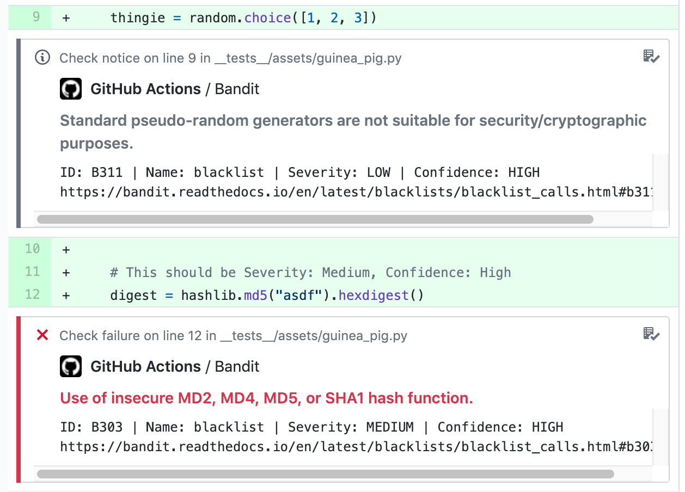

# gh-action-bandit

A GitHub action to report [Bandit](https://pypi.org/project/bandit/) issues into
GitHub check runs with annotations.

The goal is to report line-level annotations whose severity level is based on
the severity and confidence levels that Bandit reports. For example:

